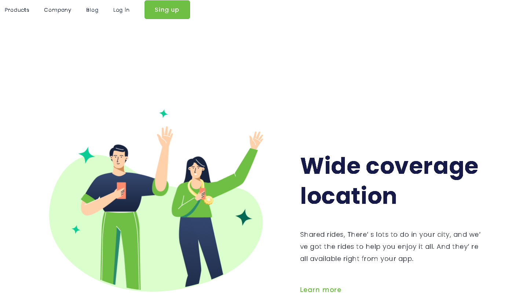

<h1> Wide Coverage Location</h1>

 Site criado com finalidade de por em prática conhecimentos de front-end e Responsividade adquiridos no curso devclub. 

 
<h2>Desenvolvido com as tecnologias:
     
     
    
         
         
    
     

<h3>vizualização em celular:</h3>
    
 

<h4>Vizualização em Desktop:</h4>

